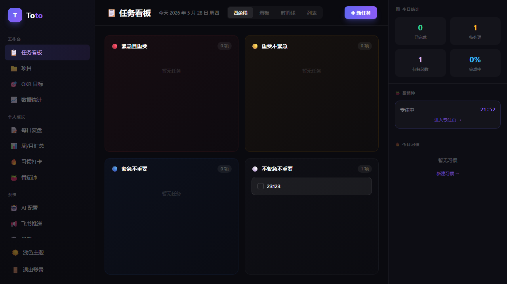
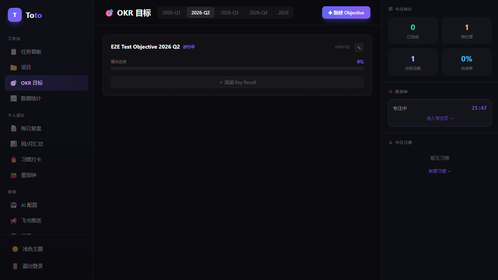
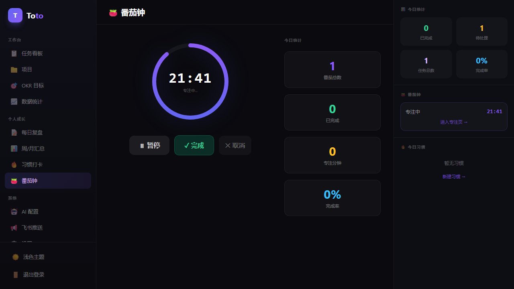
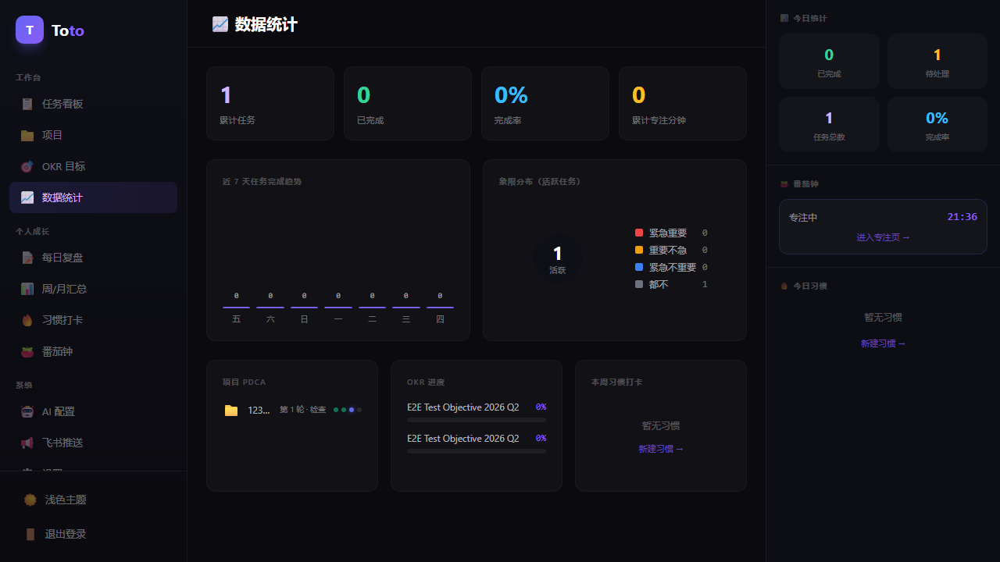

# Toto — 个人智能 To-Do 与复盘系统

> 基于 AI 的个人效率管理平台：任务四象限、PDCA 项目、习惯追踪、OKR、番茄钟、周月复盘，飞书推送一体化。



## 截图

| 仪表盘 | OKR 管理 |
|--------|----------|
|  |  |

| 番茄钟 | 数据统计 |
|--------|----------|
|  |  |

## 特性

- **任务四象限** — 按重要/紧急分类，支持看板、时间轴、列表多视图
- **PDCA 项目管理** — Plan / Do / Check / Act 完整项目生命周期
- **AI 复盘** — 接入 DeepSeek / OpenAI / 自定义 Provider，自动生成任务复盘报告
- **OKR 管理** — 目标与关键结果追踪，进度可视化
- **习惯追踪** — 每日打卡，连续天数统计
- **番茄钟** — 专注计时器，与任务关联
- **周报 / 月报** — AI 自动生成周期性汇总报告
- **飞书推送** — 每日提醒、报告推送至飞书群机器人
- **数据统计** — 任务完成趋势、时间分布图表
- **主题切换** — 明暗主题一键切换
- **多视图** — 四象限 / 看板 / 时间轴 / 列表
- **AI 提供商管理** — Web UI 配置多个 AI Provider，API Key 加密存储
- **管理员账户** — 首次启动自动种子化，bcrypt 密码哈希
- **Docker 一键部署** — 全容器化，Caddy 自动 HTTPS

## 技术栈

| 层 | 技术 |
|----|------|
| **后端** | Python 3.12 · FastAPI · SQLAlchemy 2 (async) · Alembic · Celery · Redis |
| **前端** | TypeScript · React 18 · Vite · Tailwind CSS · shadcn/ui · Recharts |
| **基础设施** | Docker Compose · Caddy 2 (自动 TLS) · PostgreSQL 16 · Redis 7 · Nginx |

## 本地开发快速启动

```bash
# 1. 克隆并配置环境变量
cp .env.example .env
# 编辑 .env，填入密码等（本地开发可用默认值）

# 2. 启动所有服务
docker compose up -d --build

# 3. 访问
# 前端:  http://localhost:4173
# API:   http://localhost:8000/docs
# 登录:  admin / admin123（首次启动 seed_admin 自动创建）
```

## 架构图

```
[Browser] → [Caddy :443] → [Nginx (web container :80)] → [React SPA]
                                      ↓ /api/* /health
                              [FastAPI (api :8000)]
                                      ↓
                         [PostgreSQL :5432]  [Redis :6379]
                                                   ↑
                                        [Celery Worker]
                                        [Celery Beat]
```

- **Caddy** 负责 TLS 终止和反向代理，生产环境监听 80/443
- **Nginx (web container)** 托管 React 静态文件，处理 SPA fallback (`try_files`)，转发 `/api/*` 到 FastAPI
- **Celery Worker / Beat** 处理 AI 复盘任务和定时推送，通过 Redis 通信

## 目录结构

```
toto/
├── backend/          # FastAPI 应用、数据库模型、Celery 任务
│   ├── app/
│   │   ├── api/      # 路由 (tasks, reviews, okrs, habits, pomodoro...)
│   │   ├── models/   # SQLAlchemy 模型
│   │   ├── schemas/  # Pydantic 模式
│   │   └── celery_tasks/  # 异步任务
│   └── tests/        # 67 个后端测试
├── frontend/         # React + TypeScript + Vite
│   └── src/
│       ├── pages/    # 页面组件
│       ├── components/  # 共用组件
│       └── api/      # API 客户端
├── docker/           # Dockerfile、nginx.conf
│   ├── Dockerfile.api
│   ├── Dockerfile.worker
│   ├── Dockerfile.web
│   └── nginx.conf
└── docs/             # 部署文档、截图
    ├── DEPLOYMENT.md
    └── screenshots/
```

## 测试

```bash
# 后端单元测试 (67 tests)
cd backend && pytest tests/ -v

# TypeScript 类型检查
cd frontend && npx tsc -b
```

## 生产部署

### 一键部署（推荐，新机器适用）

在一台装好 Docker 的服务器上：

```bash
git clone <repo> toto && cd toto
./bootstrap.sh   # 交互生成 .env，构建镜像，启动全栈，签发 HTTPS 证书
```

脚本会：
- 检查 Docker / 端口 80,443 / DNS 是否指向本机
- 提示输入 **域名**、**管理员账号密码**
- 自动生成 `JWT_SECRET` / `ENCRYPTION_KEY` (Fernet) / `POSTGRES_PASSWORD`
- 用 api 容器里的 bcrypt 哈希管理员密码
- 跑 `alembic upgrade head` 初始化数据库
- 等 Caddy 拿到 Let's Encrypt 证书

### 同一台机器跑多个项目（共享 Caddy）

如果服务器上已经有另一个项目占用了 80/443（比如另一个 Caddy/Nginx），toto 改用 **shared-edge** 模式：让上游入口反代到 toto 的 web 容器。

服务器一次性配置（把上游 caddy 接入共享网络）：

```bash
docker network create web_proxy
docker network connect web_proxy <上游 caddy 容器名>
```

部署时带 `SHARED_CADDY=1`：

```bash
SHARED_CADDY=1 ./bootstrap.sh         # 首次
SHARED_CADDY=1 ./deploy.sh            # 更新
```

最后在上游 Caddyfile 加一段把 `https://${DOMAIN}` 反代到 `todo-web-1:80`，`caddy reload` 就行。

### 升级 / 重新部署

代码更新后：

```bash
./deploy.sh                  # 自有 caddy 模式
SHARED_CADDY=1 ./deploy.sh   # 共享 caddy 模式
```

### 忘记 / 重置管理员密码

任何原因（bootstrap 失败、忘记密码）导致登录失败时，**栈在跑**的状态下：

```bash
./tool/reset_admin_password.sh        # 用 .env 里的 ADMIN_USERNAME
./tool/reset_admin_password.sh alice  # 显式指定用户名
```

脚本会让你静默输入新密码 + 二次确认，然后直接更新数据库里的 bcrypt 哈希。

详见 [docs/DEPLOYMENT.md](docs/DEPLOYMENT.md)

## 备份与恢复

```bash
# 备份（推荐设置每日 cron）
./backup.sh

# 从指定备份目录恢复
./restore.sh ./backups/2026-05-28
```

## 许可证

MIT
